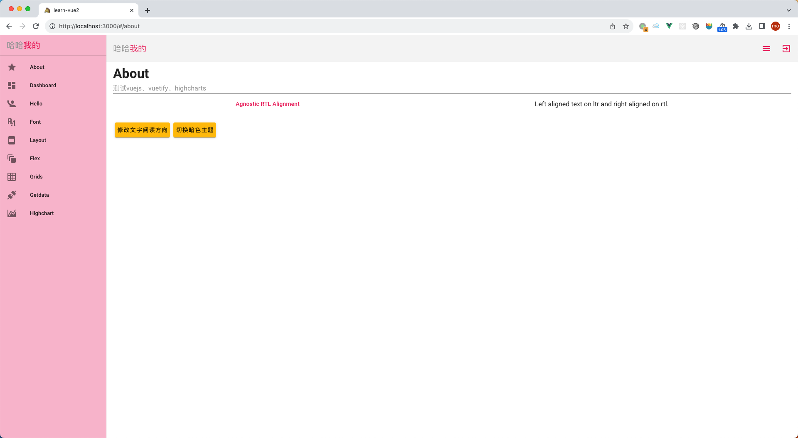

# learn-vue2

测试vue2

## 项目预览



## 启动项目
  
  ```bash
  # 进入项目目录
  # ➜  demo git:(main) pwd
  # /Users/weimo/mine/code/demo
  npm install
  npm run dev:haha
  ```

## 新模块开发流程

1. 复制packages/haha/src/modules/template/ 文件夹
2. 修改文件夹内容名字
3. 添加packages/haha/src/modules.js配置
