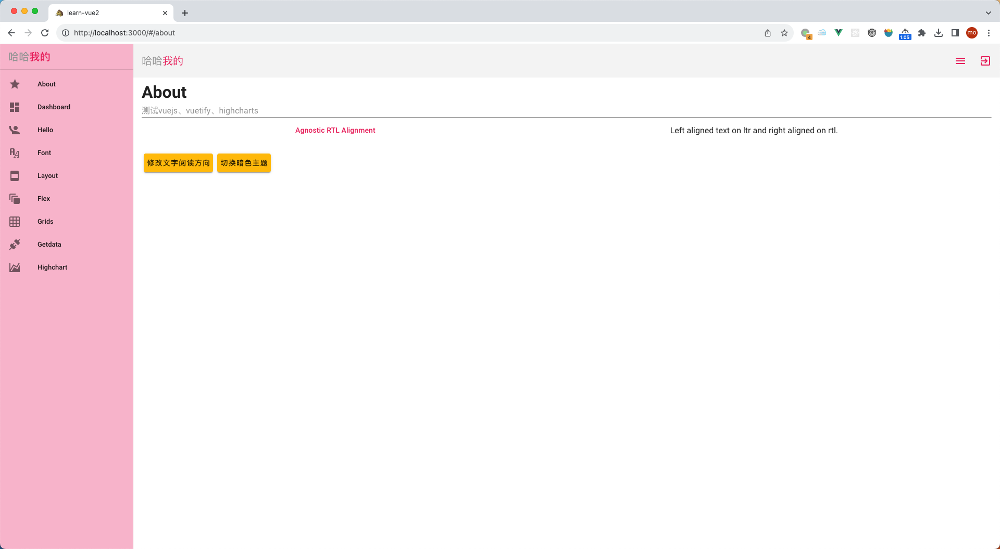

# learn-vue2

测试vue2

## 项目预览



## 启动项目
  
  ```bash
  npm install
  npm run dev
  ```

## 新模块开发流程

1. 在`src/pages`目录下新建模块目录, 如`src/pages/test`
2. 在`src/pages/test`目录下新建`index.vue`文件, 作为模块的入口文件
3. 在`src/router/index.js`中添加路由配置, 如:

  ```javascript
  {
    path: '/test',
    name: 'test',
    component: resolve => require(['@/pages/test'], resolve)
  }
  ```
